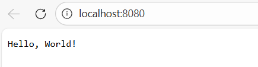
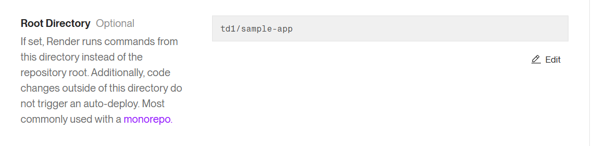
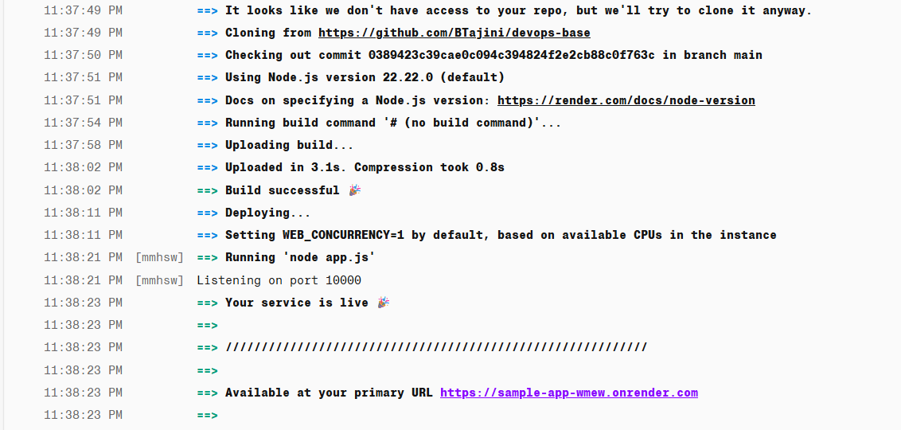
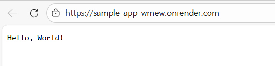
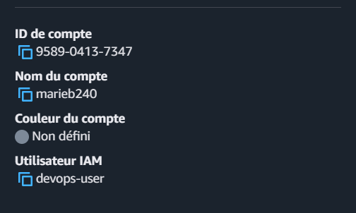
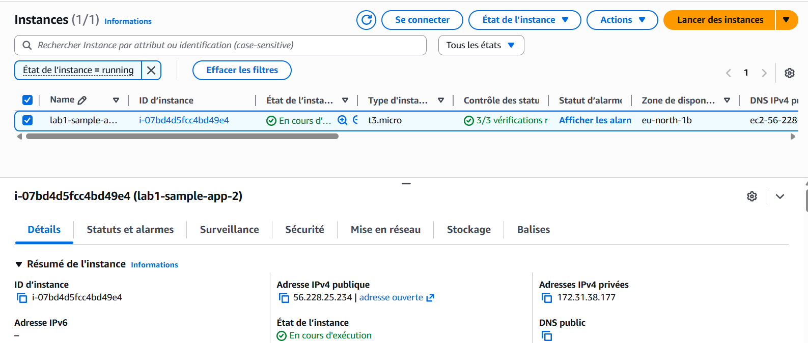
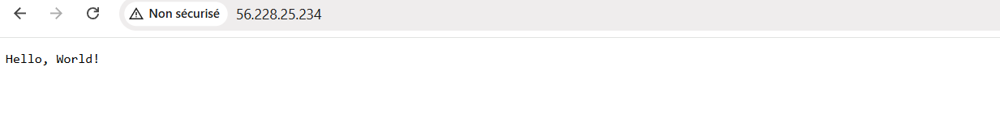

# Lab 1 - An introduction to deploying apps

## Objectifs

Le but de ce lab est de comprendre concrètement comment déployer une application :

- En local sur ma machine,
- Sur un PaaS (Render),
- Sur un IaaS (AWS EC2)

L'idée est de voir la différence entre exécuter une app sur localhost, la déployer sur une plateforme gérée et la lancer sur un serveur que l'on configure soi-même.

## Partie 1 – Exécution de l'application en local

Nous avons commencé par créer l'arborescence demandée :

```bash
mkdir -p devops_base/ch1/sample-app
cd devops_base/ch1/sample-app
```

Puis nous avons créé le fichier `app.js` avec le code Node.js fourni dans le sujet.

Ensuite nous avons lancé l'application avec :

```bash
node app.js
```

Le terminal affiche :

```
Listening on port 8080
```

En ouvrant `http://localhost:8080`, nous avons bien vu le message `Hello, World!` comme sur la photo suivante :




### Ce que l'on retient

Quand on lance l'application en local :

- elle est accessible uniquement via localhost
- elle ne peut pas être atteinte depuis l'extérieur
- elle tourne sur une machine personnelle

C'est parfait pour le développement mais pas pour exposer une application à des utilisateurs.

## Partie 2 – Deploying An App Using PaaS

Nous avons créé un compte sur Render puis suivie les différentes étapes décrites dans le PDF. Nous avons configuré notre web service avec les paramètres du PDF exceptés celui-ci : 



Où nous avons mis comme Root Directory `td1/sample-app` pour être cohérent avec le repo public.

Après quelques minutes, le statut indique que le service est live.



Render nous a généré cet URL :

```
https://sample-app-wmew.onrender.com/
```

En ouvrant cette URL dans le navigateur, nous voyons bien :



### Différences observées

Avec Render :

- Nous n'avons pas à configurer le serveur nous-mêmes
- Nous ne gérons pas l'installation de Node.js

Render s'occupe de tout.

## Partie 3 – Deploying an App Using IaaS

### Création d'un utilisateur IAM

Nous nous sommes d'abord connectés avec le compte root, uniquement pour :

- Créer un utilisateur IAM
- Attribuer la policy AdministratorAccess

Ensuite, nous nous sommes reconnectés avec cet utilisateur IAM : 




### Lancement d'une instance EC2

Dans EC2 :
Nous avons fait les mêmes configurations que dans le PDF sauf pour instance type qui sera **t3.micro**.

Le script `user-data.sh`:

- Installe Node.js
- Crée le fichier `app.js`
- Configure le port 80
- Lance l'application en arrière-plan avec `nohup`

### Test de l'application

Une fois l'instance en état **Running**, on récupère l'IP publique que l'on ouvre avec `http://<IP>`


Ici notre IP sera : 56.228.25.234
Lorsque l'on va sur notre URL on voit que l'application fonctionne :




### Ce que que l'on retient

Contrairement à Render nous devons : configurer le firewall, installer Node.js, gérer le démarrage et arrêter l'instance pour limiter les coûts

On a beaucoup plus de contrôle mais aussi beaucoup plus de responsabilités.

## Conclusion

Ce lab nous a permis de comprendre la différence entre :

- Exécuter une app en local,
- Déployer sur un PaaS,
- Déployer sur une machine virtuelle en IaaS

Le **PaaS est beaucoup plus simple et rapide à utiliser**. 

L'**IaaS donne plus de contrôle mais demande plus de configuration**.