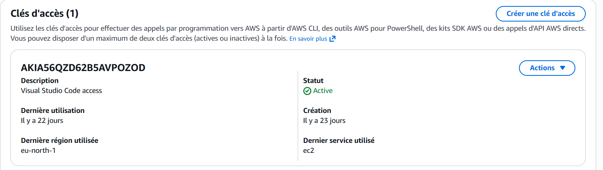
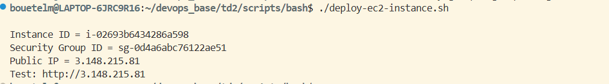
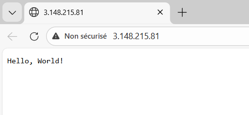
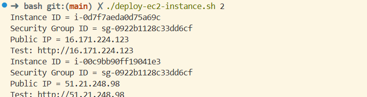
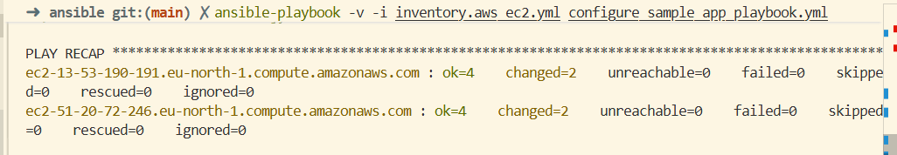
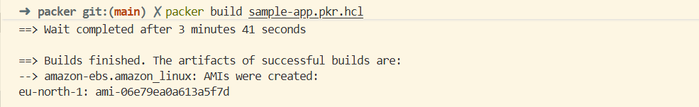
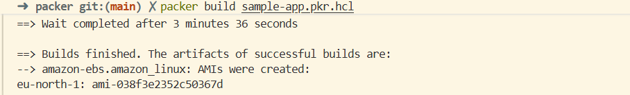
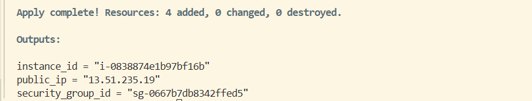
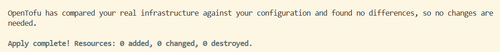
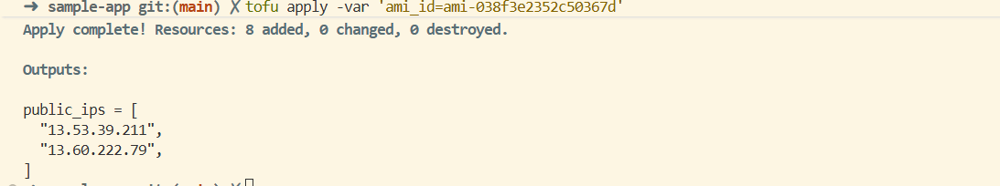

# Lab 2 - Managing Infrastructure as Code (IaC)

## Objectifs

Le but de ce lab est de mettre en pratique plusieurs outils d’infrastructure as code pour automatiser le déploiement d’une application sur AWS.

## Partie 1 – Authenticating to AWS on the Command Line

Nous avons initialisé la clef d'accès : 




## Partie 2 - Deploying an EC2 Instance Using a Bash Script

Maintenant, nous déployons une instance EC2 en utilisant un script Bash après avoir suivi les indications du PDF, notre instance tourne sur l'URL `http://3.16.38.179` comme on peut le voir sur les images suivantes :





Les deux modifications que nous avons faite, sont sur la région de l'instance qui était initialement `us-east-2` mais sur nos ordinateurs, elle est par défault initialisée à `eu-north-1` ainsi que l'AMI qui est pour la région `eu-north-1` celle-ci `ami-0836abe45b78b6960`

### Exercice 1 — Que se passe-t-il si on exécute le script une seconde fois ?

Lors de la seconde exécution, le script échoue et nous donne cette erreur : 

"An error occurred (InvalidGroup.Duplicate) when calling the CreateSecurityGroup operation: The security group 'sample-app' already exists for VPC 'vpc-0d3e740846116840d'" 

On comprend donc qu'elle échoue pendant la création du Security Group, AWS nous renvoie une erreur car un Security Group portant déjà ce nom existe dans le VPC.

Dans le script, le nom est fixe :

```bash
--group-name "sample-app"
```

### Exercice 2 — Déployer plusieurs instances EC2

Pour lancer plusieurs instances, on a ajouté une variable `COUNT` dans le script afin de choisir le nombre d’EC2 à créer en passant un argument au script. 

On utilise ensuite l’option `--count` dans la commande `aws ec2 run-instances` pour créer plusieurs machines en une seule fois.

Le script récupère maintenant plusieurs InstanceId, attend que toutes les instances soient en running puis affiche l’ID et l’IP publique de chacune. 


 


## Partie 3 – Deploying an EC2 Instance Using Ansible

Lors de la configuration de `configure_sample_app_playbook.yml` nous avons rencontré une incompatibilité : certaines anciennes instances utilisaient Amazon Linux 2 et `glibc` était trop ancien pour les paquets Node.js fournis par NodeSource. 

Pour résoudre cela, nous avons standardisé l'AMI sur Amazon Linux 2023 et adapté l'installation de Node.js (install via NodeSource compatible). 

Le playbook récupère donc la dernière AMI Amazon Linux 2023 disponible en `eu-north-1` via un lookup SSM (l'ID d'AMI peut donc varier dans le temps).

Nous avons réussi à identifier ce problème avec l'aide de GitHub Copilot.

 


### Exercice 3 — Que se passe-t-il si on exécute la configuration deux fois ?

Lorsque nous relançons, nous ne voyons pas de différences avec la première fois.

## Partie 4 – Creating a VM Image Using Packer

Nous avons créé un dossier Packer pour mettre les deux fichiers donnés dans le PDF qui seront utilisés pour créer une AMI personnalisée.

Commandes exécutées :

```bash
packer init sample-app.pkr.hcl
packer build sample-app.pkr.hcl
```

1er AMI créée :

```text
eu-north-1: ami-06e79ea0a613a5f7d
```

 


### Exercice 5 — Que se passe-t-il si on exécute `packer build` deux fois ?

Chaque exécution créera une nouvelle AMI car le nom contient un UUID :

```hcl
ami_name = "sample-app-packer-${uuidv4()}"
```
2eme AMI créée :

```text
eu-north-1: ami-038f3e2352c50367d
```
  


## Partie 5 – Déploiement avec OpenTofu

Nous lançons une instance avec OpenTofu grâce à la commande `tofu init` puis `tofu apply`. 

Lorsque `tofu apply` tourne, l'ID d'une AMI est demandée nous utilisons donc celle créé précédement par Packer `ami-038f3e2352c50367d`.

 

La public ip en sortie output, nous permet de voir ceci sur le web : 

 

### Exercice 7 —  Que se passe-t-il si vous exécutez `tofu apply` expliquez le comportement de tofu après la destruction des ressources ?

Lorsque l'on exécute `tofu apply` sans avoir exécuté `tofu destroy`, un message précisant que OpenTofu n'a trouvé aucune différence entre l'infrastructure actuelle et l'ancienne s'affiche :



On peut donc relancer la commande plusieurs fois sans modifier l'infrastructure.

### Exercice 8 —  Comment modifieriez-vous le code OpenTofu pour déployer plusieurs instances EC2 ?

Pour déployer plusieurs instances EC2 avec OpenTofu, le plus simple est d’utiliser une boucle. 

Avec `count`, on peut créer N instances à partir d’un seul bloc aws_instance. OpenTofu va générer aws_instance.sample_app[0], [1], etc. 

On peut aussi utiliser `for_each` si on veut des identifiants explicites pour chaque instance. Ça évite de dupliquer du code et c’est plus facile à maintenir.

## Partie 6 – Deploying an EC2 Instance Using an OpenTofu Module 

Après avoir suivi les modifications précisées dans le PDF, nous lançons OpenTofu avec les mêmes commandes que précédement, ce qui nous donne 2 instances lancées et fonctionnelles : 


### Exercice 9 — Modify the module to accept additional parameters like `instance_type` and `port`. Update the root module to pass these parameters

Nous avons rendu le module plus configurable en ajoutant deux variables : instance_type et port. 

Dans le module, instance_type est utilisé dans la ressource EC2 et port permet d’ouvrir le bon port dans la règle du security group. 
Ensuite, dans le root module, nous passons ces valeurs à chaque instance via les blocs module.  

Cela nous permet de modifier le type d’instance ou le port sans avoir à changer le code interne du module.

Les changements se trouvent dans les fichiers : **main.tf** et **variables.tf**.  

### Exercice 10 - Utilisez les fonctions `count` ou `for_each` d'OpenTofu pour déployer plusieurs instances sans dupliquer le code dans le module racine  

Pour ne pas dupliquer deux blocs module dans le root module, nous avons utilisé `for_each`. 

Au lieu d’écrire plusieurs fois le même module, nous définissons une liste (ou une map) d’instances puis OpenTofu crée automatiquement une instance pour chaque élément. 

Cela permet d’ajouter ou supprimer des instances sans copier-coller du code. 

Il suffit simplement de modifier la variable.


## Partie 7 - Using OpenTofu Modules from GitHub 

Nous avons modifié le fichier `ample-app/main.tf` en modifiant la source du module afin qu'elle point vers le repository github suivant : 

```
module "sample_app" {
  source   = "github.com/marieb240/DevOps-Labs.git//lab/lab2/td2/scripts/tofu/modules/ec2-instance"
```

Lorsque nous avons lancé OpenTofu avec les commandes `tofu init` et `tofu apply`, nous avons bien :  

 


 


### Exercice 11 - Découvrez l'utilisation du versionnage avec les modules en spécifiant une balise Git ou un commit spécifique dans la source du module

### Exercice 12 -  Recherchez un module OpenTofu dans le registre Terraform ou dans un autre référentiel public et utilisez-le dans votre configuration


## Conclusion

Ce lab nous a permis de comparer plusieurs approches IaC sur AWS :

- Bash : simple, mais non idempotent,
- Ansible : idempotent et orienté configuration,
- Packer : création d’images immutables,
- OpenTofu : gestion déclarative de l’infrastructure,
- Modules : standardisation et réutilisation.

Nous retenons que plus on va vers des outils déclaratifs, plus l’automatisation est fiable, reproductible et maintenable.

